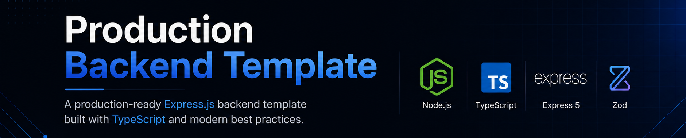

<p align="center">
  
</p>

<h1 align="center">🚀 Production Backend Template</h1>

<p align="center">
  A production-ready <strong>Express.js backend template</strong> built with <strong>TypeScript</strong> and modern best practices.
</p>

<p align="center">
  Build scalable, maintainable, and production-ready REST APIs with a clean architecture and developer-friendly tooling.
</p>

<p align="center">
  
  
  
  
  
</p>

<p align="center">
  
  
  
  
  
  
  
  
</p>

---

# 📖 Overview

**Production Backend Template** is an open-source Express.js + TypeScript starter designed to eliminate repetitive project setup and provide a clean, scalable foundation for building modern REST APIs.

Instead of repeatedly configuring logging, validation, middleware, project structure, linting, formatting, Docker, and development tooling, you can start with a production-ready architecture and focus on building features.

The template follows modern backend engineering practices while remaining simple, modular, and easy to extend.

---

# 💡 Why this Template?

Every backend project begins with the same boilerplate:

- Configure TypeScript
- Setup Express
- Configure logging
- Validate environment variables
- Add security middleware
- Configure linting and formatting
- Setup Docker
- Organize folders

This template provides those essentials out of the box so you can spend time building your application instead of rebuilding infrastructure.

---

# ✨ Features

- ⚡ Express 5
- 📦 TypeScript
- 🏗️ Modular Project Structure
- 🔥 API Versioning
- 🛡️ Helmet Security Headers
- 🌐 CORS
- 🗜️ Response Compression
- 📝 Structured Logging with Pino
- ✅ Environment Validation with Zod
- ✔️ Request Validation
- 🚨 Centralized Error Handling
- 📨 Consistent API Response Helpers
- 🎯 Path Aliases
- 🐳 Multi-stage Docker Support
- 📦 Docker Compose Support
- 🔒 Non-root Production Container
- ⚡ Optimized Docker Layer Caching
- 🧹 ESLint
- 💅 Prettier
- 🪝 Husky
- 📌 lint-staged
- ✅ Conventional Commits

---

# ⚡ Quick Start

```bash
git clone https://github.com/amandotyadav/production-backend-template.git

cd production-backend-template

cp .env.example .env

pnpm install

pnpm dev
```

---

# 📂 Project Structure

```text
src
├── api
├── core
│   ├── config
│   ├── database
│   ├── errors
│   ├── http
│   ├── jobs
│   ├── logger
│   ├── middleware
│   ├── plugins
│   ├── routes
│   ├── server
│   ├── shared
│   ├── utils
│   └── validation
│
├── modules
│   └── health
│
├── app.ts
└── server.ts
```

---

# 🚀 Getting Started

## Prerequisites

- Node.js 24+
- PNPM 10+
- Docker (optional)
- Docker Compose (optional)

---

## Clone the Repository

```bash
git clone https://github.com/amandotyadav/production-backend-template.git

cd production-backend-template
```

---

## Install Dependencies

```bash
pnpm install
```

---

## Configure Environment Variables

Copy the example environment file.

```bash
cp .env.example .env
```

Update the values according to your environment.

---

## Start Development Server

```bash
pnpm dev
```

The application will be available at:

```
http://localhost:8080
```

---

# 🐳 Docker

## Build the Image

```bash
docker build -t production-backend .
```

---

## Run the Container

```bash
docker run \
  --env-file .env \
  -p 8080:8080 \
  production-backend
```

The application will be available at:

```
http://localhost:8080
```

---

## Using Docker Compose

Start the application

```bash
docker compose up --build
```

Run in detached mode

```bash
docker compose up -d
```

Stop the application

```bash
docker compose down
```

---

## Docker Features

- Multi-stage Docker build
- Docker Compose support
- BuildKit cache mounts
- Production-only dependencies
- Non-root runtime container

---

# 📜 Available Scripts

| Command             | Description                   |
| ------------------- | ----------------------------- |
| `pnpm dev`          | Start development server      |
| `pnpm build`        | Build the application         |
| `pnpm start`        | Run production build          |
| `pnpm lint`         | Run ESLint                    |
| `pnpm lint:fix`     | Automatically fix lint issues |
| `pnpm format`       | Format the project            |
| `pnpm format:check` | Check formatting              |
| `pnpm typecheck`    | Run TypeScript type checking  |

---

# 🏛️ Architecture

The template follows a layered architecture to keep responsibilities separated and the codebase maintainable.

```text
Request
    │
    ▼
Express
    │
    ▼
Middleware
    │
    ▼
Routes
    │
    ▼
Controllers
    │
    ▼
Services
    │
    ▼
Response
```

---

# 🛠️ Tech Stack

| Technology     | Purpose            |
| -------------- | ------------------ |
| Express 5      | Web Framework      |
| TypeScript     | Static Type Safety |
| Zod            | Runtime Validation |
| Pino           | Structured Logging |
| Helmet         | Security Headers   |
| Docker         | Containerization   |
| Docker Compose | Local Development  |
| PNPM           | Package Manager    |
| ESLint         | Code Quality       |
| Prettier       | Code Formatting    |
| Husky          | Git Hooks          |

---

# 🎯 Design Principles

This project is built around a few core principles:

- Keep business logic out of the template.
- Follow a clean and modular architecture.
- Prefer composition over unnecessary abstraction.
- Validate all external input.
- Centralize configuration and error handling.
- Write type-safe, maintainable code.
- Build for scalability without sacrificing simplicity.

---

# 🤝 Contributing

Contributions are always welcome.

Whether you'd like to fix a bug, improve documentation, or propose a new feature, your contributions are appreciated.

Please read the **CONTRIBUTING.md** guide before submitting a pull request.

---

# ⭐ Support

If you find this project helpful, please consider giving it a ⭐ on GitHub.

It helps the project reach more developers and motivates future improvements.

---

# 📄 License

This project is licensed under the **MIT License**.

See the **LICENSE** file for more information.
